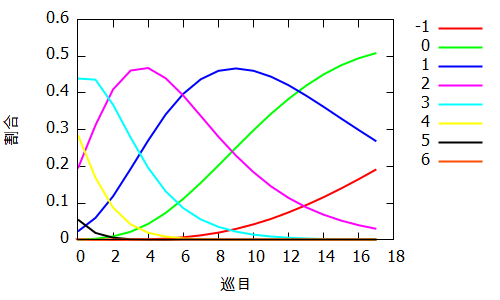
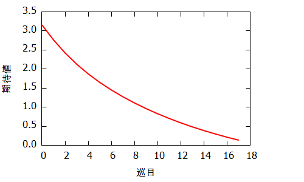

# YuukouhaiFuyouhaiCalculator
A tool for calculating necesaary tiles and unnecessary tiles for winning hands in Japanese mahjong.

[Read this in Japanese (日本語).](README.ja.md)

## What are necessary tiles and unecessary tiles in mahjong ?
- Necessary tiles:
  - the tiles needed to win with **least number of exchanges**.
  - decrease the shanten number when one of them is drawn.
  - called "yuukouhai" or "ukeire" in Japanese.
- Unnecessary tiles:
  - the tiles unneeded to win with **least number of exchanges**.
  - keep the shanten number unchanged when one of them is discarded.
  - called "yojouhai" in Japanese.

## Usage
1. Prepare an int-type array of length 34 representing a hand.
- The n th element stores the number of n th tiles.

||1|2|3|4|5|6|7|8|9|
|:--|:--|:--|:--|:--|:--|:--|:--|:--|:--|
|*Manzu*|0|1|2|3|4|5|6|7|8|
|*Pinzu*|9|10|11|12|13|14|15|16|17|
|*Souzu*|18|19|20|21|22|23|24|25|26|
|*Jihai*|27 (*East*)|28 (*South*)|29 (*West*)|30 (*North*)|31 (*White*)|32 (*Green*)|33 (*Red*)|||

- For example, if you have *manzu* tiles (1, 2, 3), *pinzu* tiles (2, 4, 5, 7, 7, 9), and *jihai* tiles (*East*, *West*, *White*, *White*, *White*), define the following array.

```cpp
int hand[34] = {
    1,1,1,0,0,0,0,0,0, //Manzu
    0,1,0,1,1,0,2,0,1, //Pinzu
    0,0,0,0,0,0,0,0,0, //Souzu
    1,0,1,0,3,0,0 //Jihai
};
```

2. Calculate the necessary tiles and the unnecessary tiles.
- (a) For winnig hands composed of *n* tile groups and a pair:
```cpp
int CalshtDW::calc_lh(int* hand, int n, unsigned long long& disc, unsigned long long& wait)
```

> **NOTE:** Normally, substitute the value obtained by dividing the number of tiles by 3 into _n_.

- (b) For winning hands of Seven Pairs:
```cpp
int CalshtDW::calc_sp(int* hand, unsigned long long& disc, unsigned long long& wait)
```
- (c) For winnig hands of Thirteen Orphans:
```cpp
int CalshtDW::calc_to(int* hand, unsigned long long& disc, unsigned long long& wait)
```
- (d) For winning hands of which the shanten number is minimum in above hands:
```cpp
int CalshtDW::operator()(int* hand, int n, int& mode, unsigned long long& disc, unsigned long long& wait)
```

> **NOTE:** The argument *mode* above represents which winning pattern of the hand gives the minimum shanten number. When the pattern is (a), *mode* is 1, when (b): 2, (c):4. If there are multiple patters, *mode* is bitwise OR of them. Therefore, *mode* is one of the values 1 to 7.

> **NOTE:** Each method returns a value of Shanten number + 1.

> **NOTE:** The arguments passed by reference *disc* and *wait* represent necessary tiles and unnecessary tiles, respectively. The n th bit's 1/0 of *wait* represents the i th tile is whether necessary or not, and the n th bit's 1/0 of *disc* represents the i th tile is whether unecessary or not, as well.

For example, calculate the necessary tiles and unneccessary tiles of the hand defined above. It requires one of *manzu* tiles (1 to 9) or one of *jihai* tiles (*East*, *West*) for winning, however one of *manzu* tiles (2, 4, 5, 7, 9) or one of  *jihai* tiles (*East*, *West*, *White*) is uneeded. The source code is as follows:

```cpp
#include <iostream>
#include <bitset>
#include "calsht_dw.hpp"

int main()
{
  // number of kinds of tiles
  constexpr int K = 34;

  CalshtDW calsht;
  int mode;
  int hand[K] = {
      1,1,1,0,0,0,0,0,0,// manzu
      0,1,0,1,1,0,2,0,1,// pinzu
      0,0,0,0,0,0,0,0,0,// souzu
      1,0,1,0,3,0,0// jihai
  };
  unsigned long long int disc;
  unsigned long long int wait;

  int sht = calsht(hand, 4, mode, disc, wait);

  std::cout << sht << std::endl;
  std::cout << mode << std::endl;
  std::cout << std::bitset<K>(disc) << std::endl;
  std::cout << std::bitset<K>(wait) << std::endl;

  return 0;
}
```
The output:
```
3
1
0010011000000000101011010000000000
0000011000000000111111111000000000
```

> **NOTE:** A compiler compatiable with C++11 or higher is needed.

## Sample Program
This program simultes single player mahjong. In each round, it discards one of unnecessary tiles, and then maximize the number of necessary tiles.

```
$ gunzip index_dw_h.txt.gz index_dw_s.txt.gz
$ make
$ ./prob.out [number of games (e.g. 1,000,000)]
$ cat result.txt
Number of Tiles         14
Total                   1000000
Time (msec.)            106499

Turn    Shanten Number (-1 - 6)                                         Hora    Tempai  Exp.
0       4       689     23224   194623  439207  285376  55254   1623    4e-06   0.000693        3.1576
1       36      3139    60055   312301  436206  169174  18856   233     3.6e-05 0.003175        2.76561
2       165     9550    118653  409619  368079  87961   5939    34      0.000165        0.009715        2.42371
3       575     22236   193284  461052  278799  42243   1805    6       0.000575        0.022811        2.12924
4       1585    43455   270484  467989  196448  19497   539     3       0.001585        0.04504 1.87492
5       3557    73558   341680  439988  132134  8916    167     0       0.003557        0.077115        1.651
6       7014    111731  397628  393033  86425   4115    54      0       0.007014        0.118745        1.45269
7       12342   155439  437312  337357  55610   1918    22      0       0.012342        0.167781        1.2743
8       19769   202505  460160  281105  35463   991     7       0       0.019769        0.222274        1.11299
9       29749   250970  466746  229544  22484   502     5       0       0.029749        0.280719        0.96557
10      42291   298561  460318  184296  14284   247     3       0       0.042291        0.340852        0.830474
11      57229   343412  444338  145635  9257    128     1       0       0.057229        0.400641        0.706667
12      74977   383949  420945  114180  5875    74      0       0       0.074977        0.458926        0.592249
13      94703   420040  392750  88629   3832    46      0       0       0.094703        0.514743        0.486985
14      116313  450680  362048  68448   2487    24      0       0       0.116313        0.566993        0.390188
15      140202  475546  330180  52435   1622    15      0       0       0.140202        0.615748        0.299774
16      165530  494708  298847  39820   1087    8       0       0       0.16553 0.660238        0.21625
17      192032  508775  268240  30169   780     4       0       0       0.192032        0.700807        0.138902
```

- The first line shows the number of hand tiles, the second line shows the number of games, and the third line shows the execution time (milliseconds).

- The sixth line onward shows the ratio of each shanten number (-1 to 6), winning ratios, *tempai* ratios, expected values of shanten numbers from left to right. The final line shows that the winning rate in single player mahjong is about 19%.

- The graph belows shows the ratios and expected values of shanten number in each round.





## Building tables (Unneeded)
- Build tables of parameters required for calculating necesaary tiles and unnecessary tiles. Make "index_dw_h.txt" and "index_dw_s.txt". 

```
$ make mkind2.out
$ ./mkind2.out
```
